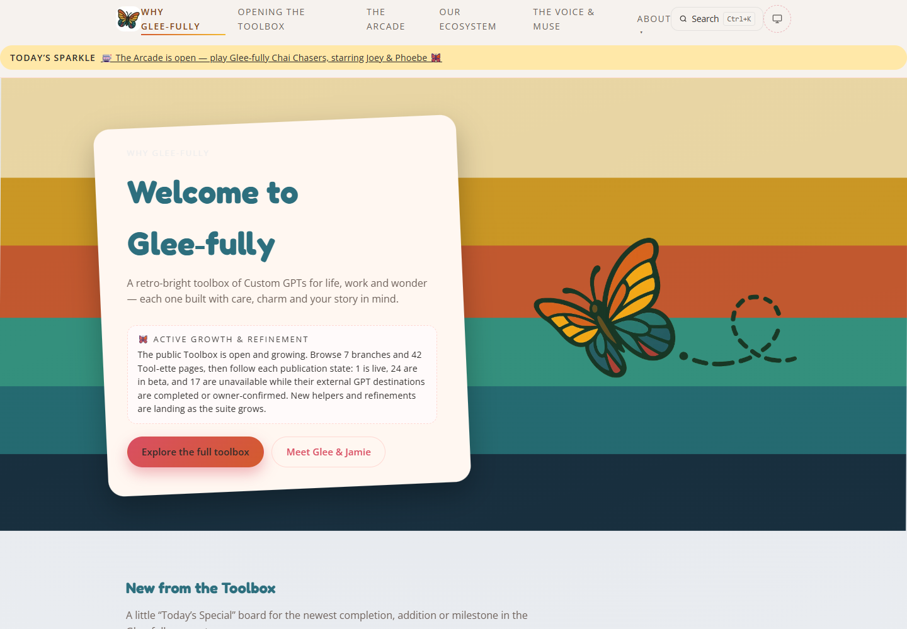
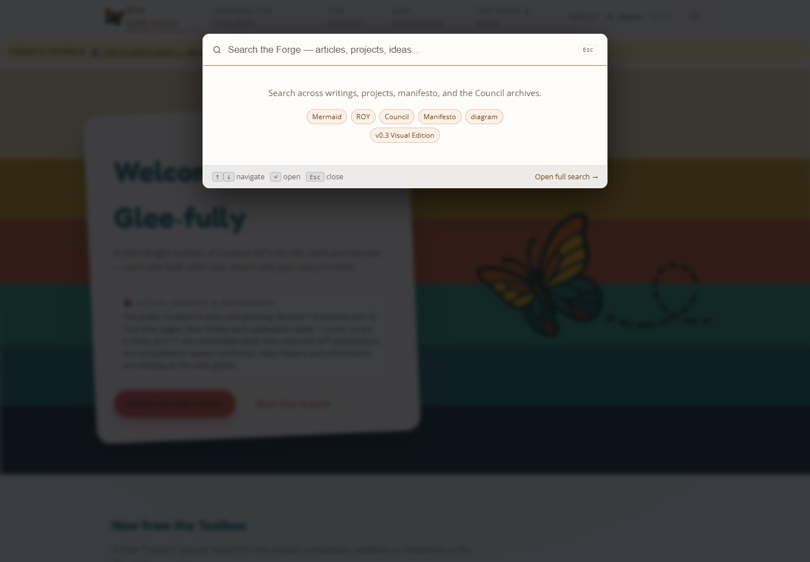
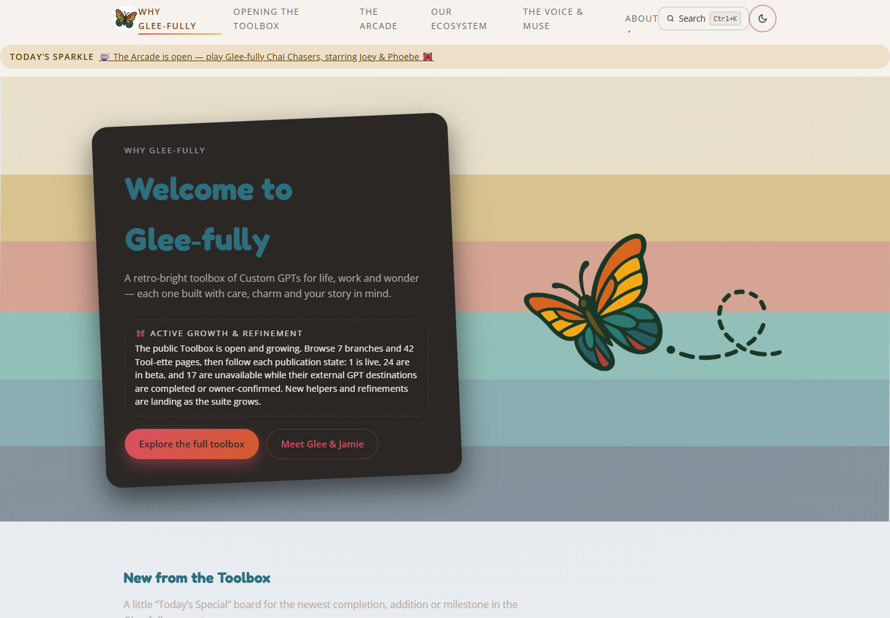
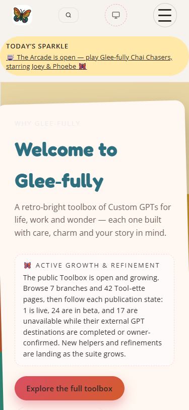

# Glee-fully Tools: Project Architect assessment

Assessment date: September 5, 2026. Target: `OKHP3/Glee-fullyTools`, https://glee-fully.tools/. Baseline: `5da805785d47f9bc29058b07d2a5467da32a1573`. Production source, Git refs, existing worktrees, repository settings, and deployment were left unchanged by the assessment team.

**Implementation update:** The subsequent corrective wave has passed local Architect review. See [Architect acceptance](architect-acceptance.md) for completed scope, exact commits, fresh checks, and outstanding release gates. Findings below retain the original assessment baseline.

**Continuation update:** The remaining authorized local corrections and proposal deliverables have also passed Architect review, including a requested correction to the lab's CLS calculation and historical evidence claims. See [continuation review](architect-continuation-review.md). Publication, live acceptance and proposal adoption remain open.

## Architectural judgment

**Keep the static architecture. Make discovery trustworthy, then make the release gates prove the visitor experience.** The site has an appropriate technical foundation, a distinctive identity, substantial content, and working deployment controls. Its weaknesses are the contracts between those parts: shared code carries the wrong brand, generated search data does not match its consumers, publication withdrawals do not cover all entry points, and source-level validation does not prove the packaged or rendered product.

The public website is a functioning catalog in active refinement. It is not a completed collection of 42 verified external products. The existing suite promise correctly distinguishes **1 live, 24 beta, and 17 unavailable Tool-ettes**, and should remain authoritative. The improvement program should make that distinction visible and consistent wherever a visitor discovers or launches a tool.

**Overall decision: NOT READY for an unqualified quality/completion claim.** Current static gates pass and production is available. Confirmed accessibility, discovery, privacy-status, and delivery defects justify a focused corrective release. No critical exploit or reason for an emergency takedown was established.

## Read this packet

| Artifact | Purpose |
|---|---|
| [This Architect assessment](architect-assessment.md) | Decisions, cross-domain priorities, visitor experience, sequencing, and acceptance |
| [Content and product Worker](content-product-worker.md) | All-page inventory, 12 finding groups, exact source references, editorial and SEO packages |
| [Infrastructure and security Worker](infrastructure-security-worker.md) | Executed checks, security, service worker, artifact construction, dependency and QA gaps |
| [Project Manager reconciliation](pm-assessment.md) | Independent source challenges, governance review, work ownership, and integration rules |
| [Assessment delegation record](worker-delegation.md) | Actual Architect > Project Manager > Worker assignments |
| [Implementation dispatch](implementation-dispatch.md) | Concrete execution mandate and persistent task status |

Machine evidence is in `assets/audit/architect-assessment-2026-09-05/`. Human findings below distinguish **Confirmed**, **Inferred**, **Proposal**, and **Unknown**. P1 means a material visitor or release-contract defect; P2 means a bounded reliability, accuracy, or maintenance improvement; P3 means a measured optimization or product experiment. P1 is not synonymous with a security emergency.

## What was actually evaluated

| Evidence surface | Fresh result and boundary |
|---|---|
| Clone and GitHub | Initial clone clean on main. Local HEAD, remote main from `git ls-remote`, latest successful Pages run, and live release provenance all identify `5da80578`. |
| Branches and checkouts | One other branch/worktree, `codex/regional-locale-menu-foundation`, associated with active PR #22. It advanced several times during this assessment; latest observed head was `4b400403`. Its work and generated outputs were preserved. |
| Public inventory | 63 production HTML files, 60 indexable URLs, 50 catalog pages, 7 branches, 42 Tool-ettes, 49 Atom entries. All production pages and leaf publication signals were inventoried. |
| Deterministic gates | 13 commands exited successfully. Structural validation: 63 pages, 0 issues, 0 warnings. Links: 2,690 internal, no broken file targets. The 1,098 external links are counted, not all visited. |
| Advisory audit | 38 findings despite exit 0: 37 metadata-length heuristics and one real missing fragment. These are not 38 equally severe defects. |
| Existing regression tests | 23 unit tests, 3 reconciliation tests, and client analytics/iframe regression mocks passed. Their coverage does not include all failures found here. |
| Broad browser inspection | Isolated 63-page x 8-width Chromium sweep: 504 successful document/CSS loads; no overflow, page errors, or first-party request/HTTP failures. One malformed Neighborly Bazaar SVG failed at all eight widths. Thirty-one pending lazy-image observations were inconclusive. Third parties were blocked and service workers disabled in that probe. |
| Live browser | Desktop 1440x1000 and mobile 375x812; homepage, modal/full search, Toolbox, Tasty Tracker, unavailable detail, Scheduling Wizard, Legal, Ecosystem, and Arcade. Seven additional route smoke checks had no observed document overflow, completed broken images, or JavaScript page errors. |
| Real interactions | Search opening and queries, Escape/focus behavior, full-page query change, mobile menu after its transition, theme cycling, service-worker registration, analytics enable/reload/disable. Analytics measurement requests were blocked during the consent test; the test browser finished with consent denied. |
| HTTP/deployment | 27 route/asset probes. Expected core responses matched local source after LF normalization; production provenance matched main. HTTPS and www redirects worked. Security disclosure returned 404; development template/profile/README returned 200. |
| Prior assessment thread | The app retrieved the identity of `Website Assessment & Triage`, thread `01a06f6c-a049-7582-8b67-59f85ff21843`, but its recent returned turn items were empty. No unseen prior decisions were assumed. |

The live release was [Pages run 33974974192](https://github.com/OKHP3/Glee-fullyTools/actions/runs/33974974192), independently identified by [release-provenance.json](https://glee-fully.tools/release-provenance.json). GitHub reported custom-workflow publishing, enforced HTTPS, an approved certificate, and protected main with strict validation/viewport/Sparkle checks, conversation resolution, administrator enforcement, and no force pushes or deletion. Required approving review count was zero. Resilience was not in the three required PR contexts, although Pages itself runs resilience. These are observed settings, not a recommendation to silently change them.

## Prioritized findings and decisions

| ID | Priority / tier | Finding and consequence | Required outcome |
|---|---|---|---|
| A01 | P1 Confirmed | Search says “Search OverKill Hill,” uses Forge/Council/Manifesto copy, and supplies unrelated suggestions. Live browser and `app.js:719` onward agree. | Brand-aware search name, instructions, and examples, with regression coverage for each supported site adapter. |
| A02 | P1 Confirmed | Index uses `section`/`branch`; both runtime consumers expect `category`. Results collapse to Page. Full search changes resume to budget while its URL remains `?q=resume`; advertised keyboard behavior lacks equivalent inline handlers. | One explicit producer/consumer contract, meaningful filters, equivalent keyboard handling, shareable query URLs and back/forward restoration. |
| A03 | P1 Confirmed | Branch and cross-tool links bypass withdrawn launch CTAs for at least eight unavailable entries. | Route discovery through truthful internal detail pages; validate all launch surfaces against publication state. Do not restore an external URL by inference. |
| A04 | P1 Confirmed | Scheduling Wizard is publicly indexed with “Short, personality-rich tagline” and other authoring instructions. | Replace the scaffold with an honest unavailable concept brief using already approved descriptions, retain useful internal next actions, and reject scaffold text in QA. |
| A05 | P1 Confirmed | Light homepage eyebrow computes to about **1.10:1** contrast. Dark headline computes to **2.61:1**, below even the large-text threshold. | Fix the Glee-specific text tokens/selectors and assert rendered colors in light, dark, and device-following modes. |
| A06 | P1 trust / P2 fix, Confirmed | Analytics status reverts to “off” after reload while saved consent remains granted and initialization enables the loader. | Hydrate status from effective consent on startup; test reload and storage-denied behavior. Preserve default-off measurement. |
| A07 | P1 delivery, Confirmed symptom / Inferred cause | `.well-known/security.txt` is valid locally but returns 404. Generic artifact upload omits hidden files by default and no inclusion is configured. | Verify required hidden public files through packaging, upload/download, and live smoke. Validate a constrained artifact before enabling hidden-file transfer. |
| A08 | P2 Confirmed | Development templates, brand profile, and README are live public routes outside the 63-page validation boundary. | Define an explicit public inventory; exclude development content from the artifact without deleting source assets. |
| A09 | P1 assurance, Confirmed | Current viewport gate omits script errors, network failures, decoded-image checks, and delayed Mermaid readiness. Existing passing tests miss A01-A06. | Add representative behavioral and computed-style checks plus deliberate negative tests. Keep optional dependency failures separate. |
| A10 | P2 Confirmed control flow | `sw.js` can replace a successful online response with offline content when a cache write fails. VM reproduction confirms it; field frequency is unknown. | Make cache writes best effort, handle rejected storage safely, and preserve valid network responses. |
| A11 | P2 Confirmed mechanism / Inferred risk | Full navigation request URLs are cached without bounds; imported Glee adapter is outside explicit precache. | Define query handling and bounded cache growth; test cold offline adapter behavior independently of ordinary HTTP cache. |
| A12 | P1 accuracy, Confirmed | Identity Known, bLinkIn Tuner, and Maven Wise descriptions conflict across parent/detail surfaces. Some personalization, privacy, and memory claims exceed available external-tool evidence. | Reconcile against the current reviewed definitions; distinguish intended behavior from demonstrated behavior. |
| A13 | P2 Confirmed | Homepage “Explore the full toolbox” links to Ecosystem. Toolbox then foregrounds an external concierge before its branch catalog. | Make the labeled browse path direct; distinguish browsing the catalog from opening the external Toolbox GPT. |
| A14 | P2 Confirmed | All 42 SoftwareApplication graphs repeat free/offer/screenshot assumptions, including unavailable concepts. Showcase overstates rich-result eligibility. | Remove unsupported structured claims and correct portfolio wording; never manufacture ratings or evidence. |
| A15 | P2 Confirmed | Sitemap/feed dates and Legal's 2025 update label lag substantial content changes. Feed maintenance is explicitly deferred in the current contract. | Recover meaningful content dates; propose a maintained feed process. Do not mass-stamp today's date or resurrect an archived generator. |
| A16 | P2 Confirmed | Active agent instructions call retired/missing scripts or promise rebuilds from a check-only hook. Roadmap/CSP policy descriptions lag implemented controls. | Publish one executable current runbook; preserve dated history and active stronger controls. |
| A17 | P2 Confirmed mechanism / Inferred risk | Two-group foundation synchronization chooses a canonical file using latest Git touch time. | Require an explicit reviewed source and semantic compatibility evidence before future cross-site promotion. |
| A18 | P2 Confirmed | QA dependencies float; native viewport setup assumes a gcc/Nix shim; optional Node tooling needs a newer runtime than the Replit declaration. | Separate site runtime from QA runtime; propose reproducible pins and host-aware setup, with dependency changes reviewed separately. |
| A19 | P3 Proposal | Four font families, a large shared stylesheet, a roughly 202 MB compressed Pages artifact, and a 60-entry search corpus warrant measurement. | Establish cold/repeat route budgets and field evidence before introducing font, CSS, image, or build changes. Artifact size is not per-visit transfer. |
| A20 | P2 Confirmed | Neighborly Bazaar's SVG fails to decode at all eight viewport widths. A literal `<30 min` at SVG line 67 is invalid XML. One of 43 inspected SVGs failed parsing. | Escape the literal character and add XML/decode checks; preserve the illustration and its meaning. |

Exact supporting source references and narrower acceptance criteria are in the two Worker reports and PM reconciliation. A07 uses current [upload-artifact documentation](https://github.com/actions/upload-artifact#uploading-hidden-files): hidden entries are excluded by default. The 202 MB figure is GitHub's fresh artifact API size, not a downloaded ZIP inventory. Archive contents were not downloaded in this assessment; therefore the precise hidden-file omission stage remains an inference supported by workflow source and the live 404.

## UI and UX recommendations

**Preserve the butterfly, warm voice, cream/coral/teal identity, and tree taxonomy.** They give the site character and orientation. The problem is that the interface asks visitors to understand the suite's internal vocabulary and release state before showing an obvious useful task.

The homepage's status paragraph is honest but visually expensive. At 375x812, it consumes much of the first screen and the primary action sits near the bottom. On desktop, the navigation uses long uppercase labels that wrap despite the ample viewport. These are observed layouts; their impact on conversion is an inference because no representative user study was conducted.

**Proposal:** keep a concise availability summary above the fold, move the detailed state explanation alongside the catalog, and make “Browse tools” the direct primary action. Add a few plain-language task entry points drawn from current approved content, such as resume work, organizing a collection, or planning daily tasks. They should route into the existing branches without renaming or flattening them. Label launch-ready, beta, and unavailable results before a click. An unavailable card should still explain the concept and offer related internal choices.

Tool detail pages contain a median 957 words in their main content, with some exceeding 1,300. Length is not itself a defect, but repeated launch guidance and architectural language can obscure the practical starting point. A future detail pattern should front-load: what it is for, current state, what to bring, what happens next, and the relevant third-party boundary. Deeper examples can follow. Prototype pages need honest, shorter descriptions, not filled-out templates that imply functioning capabilities.

The Arcade is a valid adjacent product surface and an effective visual feature. Preserve the separate game identity and direct-link fallback. Its promotion in the Sparkle banner and home feature should not make every internal search result match “arcade” or “chai.” Fix index extraction from useful main content before tuning scoring.

Search is the highest-value interaction to repair first. A useful acceptance set is: “resume” leads with resume helpers; “budget” exposes the spending helper rather than the search page; unavailable tools visibly say unavailable; a nonsense query gives a useful empty state; keyboard users can open, navigate, activate, and close results; a shared URL restores the intended query; a failed index offers retry and directory routes.

## Accessibility evidence and limits

The light eyebrow color was `rgba(229,231,235,0.6)` over the card pseudo-element's `rgb(255,247,241)`. Alpha compositing gives approximately `rgb(239.4,237.4,237.4)` and a 1.097:1 ratio. After the dark transition settled, the heading was `rgb(45,111,126)` over `rgb(42,39,36)`, ratio 2.607:1. The theme button changed `data-color-scheme`; the global light rule also uses a separate `data-theme` convention. Repair the actual scoped cascade rather than adding arbitrary color exceptions.

The observed mobile search button measured about 39.6x30 CSS pixels. That misses the repository's preferred 44x44 target but does not automatically fail WCAG 2.2 AA's 24x24 minimum. The distinction matters. The settled mobile menu was contained at y=60 through y=510, its first link received focus, and Escape worked. An early screenshot captured an animation mid-transition and was excluded from defect evidence.

Use [WCAG 2.2](https://www.w3.org/TR/WCAG22/) for the actual contrast and target criteria and retain the repository's stronger ergonomics where feasible. Add keyboard traversal at 200% zoom and 320 CSS-pixel reflow, reduced motion, forced colors, long labels, and screen-reader checks. Current evidence is not a WCAG conformance certification. NVDA/VoiceOver testing and a representative assistive-technology user journey remain unperformed.

## Security, privacy, and operations

The site already has substantive controls: browser-enforced hash-based page CSP, constrained external origins, no first-party account or database, opt-in analytics, and a cross-origin sandboxed Arcade. Do not repeat old advice that all CSP hardening is still pending. Source inspection established no exploitable DOM injection; no broad penetration test or private-history secret scan was undertaken.

The public HTTP response includes HSTS, but lacks HTTP CSP, framing protection, and the other policies described by the portable `_headers` file. Meta CSP remains useful; `frame-ancestors` cannot be supplied by meta, as [MDN documents](https://developer.mozilla.org/en-US/docs/Web/HTTP/Reference/Headers/Content-Security-Policy/frame-ancestors). This is a residual hosting decision, not permission to migrate DNS or add an edge provider. Correct the local packaging and status defects first, then decide whether the residual threat model merits a new hosting control.

Default-off analytics was supported by source and a live fresh session with no observed analytics loader. Google Fonts still makes third-party requests as disclosed. The consent reload defect must be fixed, but it is not evidence of pre-consent analytics. Provider-side retention, deletion behavior, and regional legal compliance were not verified. Stronger privacy claims must await appropriate owner evidence.

The release workflow's exact-commit checks and provenance are worth retaining. The next step is to validate the artifact actually transferred between jobs, then prove the deployed version, representative routes, and required files. GitHub documents the dependency and permission model for [custom Pages workflows](https://docs.github.com/en/pages/getting-started-with-github-pages/using-custom-workflows-with-github-pages). Keep the permission grant in the deployment job and preserve the site's existing static-source workflow.

## Content, SEO, and proof

Prioritize truth over metadata polishing. A description under a preferred character count does not compensate for a misrouted launch or an unfinished scaffold. Treat the 37 title/description advisories as editorial review prompts, not search-engine failures.

A catalog page can be indexed even when its external destination is unavailable, provided the page offers useful, truthful information. Whether Scheduling Wizard should remain indexed is an editorial decision; a brief grounded concept page is the smallest safe initial correction. Do not change the 60-page inventory just to hide a defect.

Structured data must describe evidence the page supports. The current free-offer and screenshot claims are particularly weak for unavailable concepts and illustrative SVGs. Google software rich-result requirements include properties beyond syntactic JSON validity; see [Google's SoftwareApplication guidance](https://developers.google.com/search/docs/appearance/structured-data/software-app). Never fabricate reviews to satisfy those requirements. Likewise, sitemap dates should reflect significant content updates, as [Google's sitemap guidance](https://developers.google.com/search/docs/crawling-indexing/sitemaps/build-sitemap) explains.

The Showcase should demonstrate visitor outcomes and dated evidence. Correct assertions about every tool having a launch link, Ko-fi widgets, no package.json, search implementation details, and unmeasured response speed. Describe “no application build/runtime dependency” accurately while acknowledging optional QA tooling. Remove the homepage's unverified GPT-5 model claim using durable language; do not replace it with GPT-6 simply because this audit uses a newer model.

## Recommended program and delegation boundaries

| Wave | Scope | Suggested execution and exit condition |
|---|---|---|
| 1: Correct confirmed visitor defects | A01-A07, A12-A13, targeted A09 regressions | Implementation PM delegates content, runtime/search, and accessibility/artifact Workers with exclusive ownership. Deliver focused tested commits in isolated worktrees for Architect review. |
| 2: Strengthen delivery and resilience | A08-A11, A16, report provenance | Validate public artifact after transfer, service-worker storage failures, cross-platform runner behavior, and executable runbooks. Coordinate with PR #22 before any overlapping CSS/SW change. |
| 3: Reconcile evidence and metadata | A14-A15, Showcase, current governance | Produce reviewable content/schema corrections and a content-date proposal. Keep explicitly deferred feed/timestamp policy choices pending. |
| 4: Improve task success with evidence | Homepage hierarchy, concise detail pattern, status-aware cards, performance | Design proposals and small representative prototypes first. Measure before broad rollout. |
| 5: Decide shared-platform and host policy | A17-A19, immutable Actions, hosting headers | Separate ADR/proposal. No blind sibling synchronization, dependency upgrade, framework migration, DNS change, or host purchase. |

Indicative planning units, not commitments: isolated link/status repairs are small; search contract repair and artifact acceptance are medium; a catalog-wide editorial proof pass is medium to large. The PM should estimate after confirming final main and PR #22. Avoid a single omnibus change combining all findings.

The Architect owns findings, scope, evidence review, and acceptance. The implementation PM owns assignment, worktree hygiene, exclusive file lists, conflict resolution, and integration. Workers own bounded implementations and failing-before/passing-after tests. Generated search JSON, CSS tokens, HTML fingerprint updates, and offline cache version belong to one serialized integration step. The site retains one stylesheet and the existing taxonomy.

Codex is the preferred initial executor because it can reproduce the local findings and coordinate worktrees. Copilot can later take a narrow, testable issue or review a PR. Replit is suitable for an approved visual prototype or preview after a concrete handoff. Neither needs to receive a vague “modernize everything” request. No external messages or tasks were sent to Copilot or Replit by this assessment.

## Acceptance and measurement

Before accepting the first corrective release, require a current clean baseline and documented handling of PR #22; new regression tests that fail against the relevant broken behavior; all required repository checks; all-page route/asset coverage; mobile/desktop light/dark screenshots; keyboard search and menu flows; consent reload tests with analytics traffic suppressed; artifact inventory assertions; and a coherent final diff. Before claiming live completion, verify the deployed provenance and routes after the actual publication event.

For subsequent product work, use proposed measures such as: visitor reaches a suitable tool detail in two meaningful choices from the homepage; publication state is visible before leaving the site; representative task queries rank useful results; unavailable pages offer a relevant next route; and users understand which platform receives their data. Validate those targets with people before claiming success.

Performance targets should distinguish lab from field evidence. The usual good Core Web Vitals thresholds are LCP <=2.5 seconds, INP <=200 ms, and CLS <=0.1 at the 75th percentile. See [Web Vitals](https://web.dev/articles/vitals). No field score, Lighthouse score, or conversion improvement is claimed by this assessment. Measure home, branch, detail, search, and diagram routes under cold/repeat cache and constrained CPU/network before approving optimization work.

## Remaining unknowns

Fresh behavior of every external GPT; owner-confirmed alternate destinations; actual accounts, memory, data retention, and platform settings; email delivery; analytics-property configuration; Search Console/Bing access and indexing results; real-user metrics; exhaustive assistive-technology conformance; actual ZIP contents after each artifact boundary; full secret/advisory audit; and the final disposition of changing PR #22. Each is separately verifiable and must not be inferred from the green static checks.

## Selected visual evidence

The screenshots below are direct live Chromium captures. The dark image was captured after the theme transition settled. They show the observed baseline, not a proposed redesign.

