# Historical universe concept map

Preserved before index-driven navigation replaced the hand-authored map. These nodes and links record earlier ideas, not current publication or completion claims. Restore a planned node only through an explicit lifecycle decision in the site configuration.

```mermaid
graph LR

                    OKH["OverKill Hill P³™"]
                    GPT["Glee‑fully Personalizable Tools™"]
                    GTTB00["00 — Glee‑fully Toolbox"]
                    GTDC01["01 — Discovered Careers"]
                    GTTF02["02 — Treasured Finds"]
                    GTTT03["03 — Tasty Tracker"]
                    GTTG04["04 — Traveler’s Guide"]
                    GTOL05["05 — Organized Life"]
                    GTHB06["06 — Healthy Bee‑ing"]
                    GTIK07["07 — Identity Known"]
                    ASJ["AskJamie™"]
                    AJ01["AJ01 — Résumé Representative"]
                    AJ02["AJ02 — Professional Portfolio"]
                    AJ03["AJ03 — Enterprise Sleuth"]
                    AJ04["AJ04 — OKHP³ BrandGuard™"]
                    BRG00["BRG00 — Builders FirstSource"]
                    BRG01["BRG01 — LEGO"]
                    BRG02["BRG02 — Starbucks"]
                    BRG03["BRG03 — Brooks Running"]
                    BRG04["BRG04 — Ping"]
                    BRG05["BRG05 — Costco"]
                    BRG06["BRG06 — Hershey"]
                    BRG07["BRG07 — LVMH"]
                    BRG08["BRG08 — Dollar General"]
                    BRG09["BRG09 — Coca-Cola"]
                    BRG10["BRG10 — Discount Tires"]
                    BRG11["BRG11 — Scheels"]
                    BFS01["BFS — Framing Intelligent Futures"]
                    UNT00["UNT00 — Un‑NOCKed Truth"]
                    UNT01["UNT01 — Geared-Up"]
                    UNT02["UNT02 — Dialed-In"]
                    UNT03["UNT03 — Hunted-Down"]
                    PSR00["PSR00 — PathScrib-R"]
                    ARE00["ARE00 — Abrahamic Reference Engine"]
                    HMT00["HMT00 — HomeTools"]
                    HMT01["HMT01 — Homestead‑R"]
                    HMT02["HMT01 — HomeVisual-R"]
                    HMT03["HMT01 — FloorPlan-R"]
                    HMT04["HMT01 — HomeEstimate-R"]
                    FDY00["FDY00 — The Found-Rᵧ"]
                    FDY99["GPTs to build GPTs"]
                    WRIT["Writing & Narrative Experiments"]
                    KNO["Knowledge Files"]
                    PRO["Protocols & Promptcraft"]
                    MPS["Magnus Progenitor Saga"]
                    BAC["Biases as Constants"]

                    OKH --> GPT
                    GPT --> GTTB00
                    GTTB00 --> GTDC01
                    GTTB00 --> GTTF02
                    GTTB00 --> GTTT03
                    GTTB00 --> GTTG04
                    GTTB00 --> GTOL05
                    GTTB00 --> GTHB06
                    GTTB00 --> GTIK07
                    OKH --> ASJ
                    ASJ --> AJ01
                    ASJ --> AJ02
                    ASJ --> AJ03
                    ASJ --> AJ04
                    AJ04 --> BRG00
                    AJ04 --> BRG01
                    AJ04 --> BRG02
                    AJ04 --> BRG03
                    AJ04 --> BRG04
                    AJ04 --> BRG05
                    AJ04 --> BRG06
                    AJ04 --> BRG07
                    AJ04 --> BRG08
                    AJ04 --> BRG09
                    AJ04 --> BRG10
                    AJ04 --> BRG11
                    OKH --> BFS01
                    OKH --> UNT00
                    UNT00 --> UNT01
                    UNT00 --> UNT02
                    UNT00 --> UNT03
                    OKH --> PSR00
                    OKH --> ARE00
                    OKH --> HMT00
                    HMT00 --> HMT01
                    HMT00 --> HMT02
                    HMT00 --> HMT03
                    HMT00 --> HMT04
                    OKH --> FDY00
                    FDY00 --> FDY99
                    OKH --> WRIT
                    WRIT --> KNO
                    WRIT --> PRO
                    WRIT --> MPS
                    WRIT --> BAC

                    %% Clickable links
                      click GPT "https://glee-fully.tools/" "Visit Glee‑fully Tools™" _blank
                      click GTTB00 "https://glee-fully.tools/toolbox/" "Open the Toolbox hub" _self
                      click GTDC01 "https://glee-fully.tools/toolbox/01-discovered-careers/" "Open Discovered Careers" _self
                      click GTTF02 "https://glee-fully.tools/toolbox/02-treasured-finds/" "Open Treasured Finds" _self
                      click GTTT03 "https://glee-fully.tools/toolbox/03-tasty-tracker/" "Open Tasty Tracker" _self
                      click GTTG04 "https://glee-fully.tools/toolbox/04-travelers-guide/" "Open Traveler’s Guide" _self
                      click GTOL05 "https://glee-fully.tools/toolbox/05-organized-life/" "Open Organized Life" _self
                      click GTHB06 "https://glee-fully.tools/toolbox/06-healthy-bee-ing/" "Open Healthy Bee‑ing" _self
                      click GTIK07 "https://glee-fully.tools/toolbox/07-identity-known/" "Open Identity Known" _self
                      click ASJ "https://askjamie.bot/" "Visit AskJamie™" _blank
                      click AJ01 "https://askjamie.bot/lens-system/resume-representative/" "Open Résumé Representative" _self
                      click AJ02 "https://askjamie.bot/lens-system/professional-portfolio/" "Open Professional Portfolio by AskJamie™" _blank
                      click AJ03 "https://askjamie.bot/lens-system/enterprise-sleuth/" "Open Enterprise Sleuth" _self
                      click AJ04 "https://askjamie.bot/lens-system/okhp3-brandguard/" "Open OKHP³™ BrandGuard™" _self
                      click BRG00 "https://askjamie.bot/lens-system/okhp3-brandguard/bfs-framing-intelligent-futures/" "Open BFS – Framing Intelligent Futures" _self
                      click OKH "https://overkillhill.com/" "Visit OverKill Hill P³™" _blank
                      click BFS01 "https://overkillhill.com/projects/bfs-framing-intelligent-futures/" "Open BFS – Framing Intelligent Futures" _self
                      click UNT00 "https://overkillhill.com/projects/un-nocked-truth/" "Open Un‑NOCKed Truth" _blank
                      click ARE00 "https://overkillhill.com/projects/abrahamic-reference-engine/" "Open Abrahamic Reference Engine" _blank
                      click PSR00 "https://overkillhill.com/projects/pathscrib-r/" "Open PathScrib‑R" _blank
                      click HMT00 "https://overkillhill.com/projects/hometools/" "Open HomeTools" _blank
                      click FDY00 "https://overkillhill.com/found-ry/" "Open The Found-Rᵧ" _blank
                      click MPS "https://overkillhill.com/writings/magnus-saga/" "Open Magnus Progenitor Saga" _blank
                      click BAC "https://overkillhill.com/writings/biases-as-constants/" "Open Biases as Constants" _blank
```

